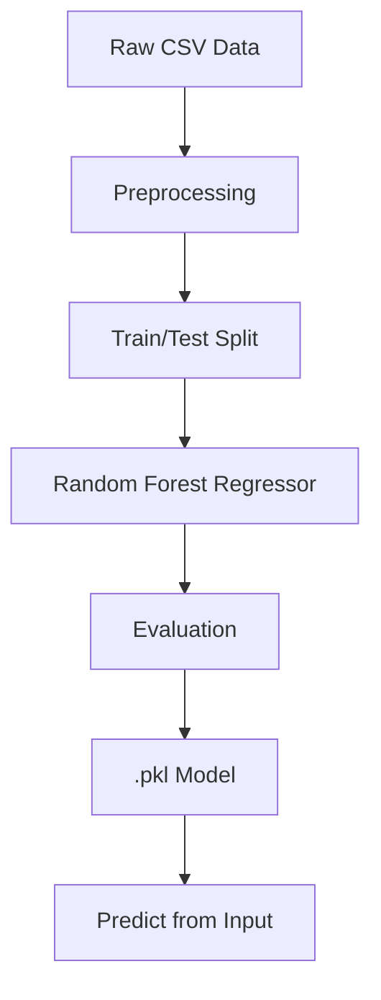

# 🚗 CAR PRICE PREDICTOR


### A machine learning-based car price prediction system built with Python and scikit-learn.

---

## ⚙️ Features

- Predicts used car prices based on:
  - **Brand & Model**
  - **Year of Manufacture**
  - **Fuel Type**
  - **Kilometers Driven**
- Implements **Random Forest Regressor** for robust performance.
- Preprocessing pipeline includes:
  - Missing value handling
  - Label encoding
  - Feature scaling
- Interactive CLI & Jupyter-based prediction support.
- Model serialization using **Pickle**.
- Dataset visualization for insight-driven feature engineering.

---

## 🧠 Architecture

- The pipeline is structured into the following components:
    1. **Data Preprocessing**
    2. **Model Training**
    3. **Evaluation**
    4. **Model Export**
    5. **Prediction Interface**



---
## 🧪 Testing

- Validation includes:
    - Model accuracy metrics (MAE, RMSE, R²)
    - Manual test cases for sample predictions

- Future: Add pytest-based unit tests for components

---

## 💻 Installation & Usage
- 📥 Clone and Set Up
  ```sh
  git clone https://github.com/Amit-bhalothia/car-price-predictor.git
  cd car-price-predictor
  pip install -r requirements.txt
  ```

- 🧠 Train the Model 
  ```sh
  python src/train.py
  ```

- 📈 Predict a Price
  ```sh
  python src/predict.py --input '{"brand": "Toyota", "year": 2019, "fuel_type": "Petrol",
  "kms_driven": 35000}'
  ```

- 📊 Sample Prediction
  ```sh
    Input:
  {
    "brand": "Hyundai",
    "year": 2017,
    "fuel_type": "Diesel",
    "kms_driven": 52000
  }
  
  Output:
  Predicted Price: ₹4,85,000
  ```
---
## References :

- Dataset sourced from publicly available used car listings.

- ML concepts inspired by the book Hands-On Machine Learning with Scikit-Learn.

- Model selection guided by industry trends and scikit-learn benchmarks.

## Licence :
- MIT

## Future Features :

- Streamlit-based web UI

- Hyperparameter tuning using GridSearchCV

- Model explainability with SHAP

- Deploy via Docker and GitHub Actions
  


